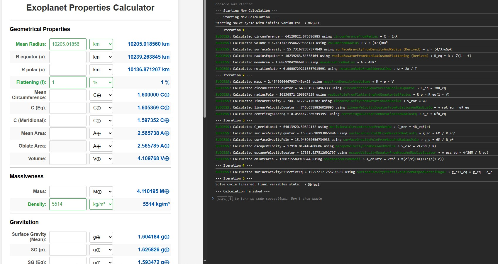

# Exocalc 🪐

**Exocalc** is a web-based astronomical calculator that demonstrates a **deterministic iterative solver**, this case was specifically engineered to compute the physical characteristics of exoplanets.

Unlike traditional calculators that force you into a rigid, one-way input/output flow, Exocalc handles **20+** variables and solves equations **bidirectionally**. 

## 🚀 Core Idea of the Solver

Instead of relying on a fixed calculation order, the solver propagates known values through a shared "pool of equations." Newly derived values are fed back into the next iteration until no further data can be extracted.

1. **Input:** You provide a small set of known values.
2. **Propagation:** The system simultaneously applies equations in both their forward and inverse forms.
3. **Iteration:** Newly derived values are automatically reused in the next cycle.
4. **Convergence:** The process repeats seamlessly until the entire system converges on a solution OR no more values can be extracted.

---

## 🌐 Live Demo

### 🔗 [Launch the Live Demo](https://artriant.github.io/exocalc/)

  
   
  <i>Exocalc interface (left) paired with the browser's step-by-step solver logging (right).</i>

---

## ✨ Features

- Iterative solving engine
- Bidirectional equation support (forward and inverse forms)
- Internal SI unit system
- Support for reference units (such as Earth and Jupiter units)
- Step-by-step console logging of the solving process
- Conflict-aware input validation
- Quality-of-life features:
  - Instant unit conversion in the output when comparison mode is ON
  - Quick unit swap buttons
  - Enter-to-recalculate
  - Auto-recalculation mode

---

### Why Exocalc?
* **For Space Enthusiasts & Researchers:** Quickly fill in the blanks when looking at the sparse data of a new discovery: Only R and M is given Exocalc will calculate 6 more values
   * Hypothesize and arrive in conclusions with direct feedback, 
* **For Worldbuilders:** Instantly check the 'scientific plausibility' of your fictional worlds by tweaking variables on the fly!
* **For Educators & Students:** 
   * Exocalc can be used to demonstrate how planetery values change on the fly, affecting one another, 
   * To Demosntrate an iterative solver,
   * Use it on space related events
* **Cross-reference** values on existing tables

> [!WARNING]
> **Scientific Accuracy & Limitations**
> This tool is a simplified model and does not claim 100% scientific accuracy. Known discrepancies exist; for example, it utilizes the inverse-square law to calculate gravity, whereas methods like spherical harmonics are far more precise. Additionally, outputs do not include statistical metrics such as margins of error, uncertainty, or confidence intervals. This tool should be used for estimation and educational purposes, not as scientific proof.

## 📖 Documentation

Visit <a href="https://artriant.github.io/exocalc/Info.html" target="_blank"><code>Info.html</code></a> to learn more about:
* Conventional values, constants, and units used.
* Theoretical background and usage guidelines.

---

## 🛠️ Project Status

Early working version (v0.7 prototype).
Active development ongoing.